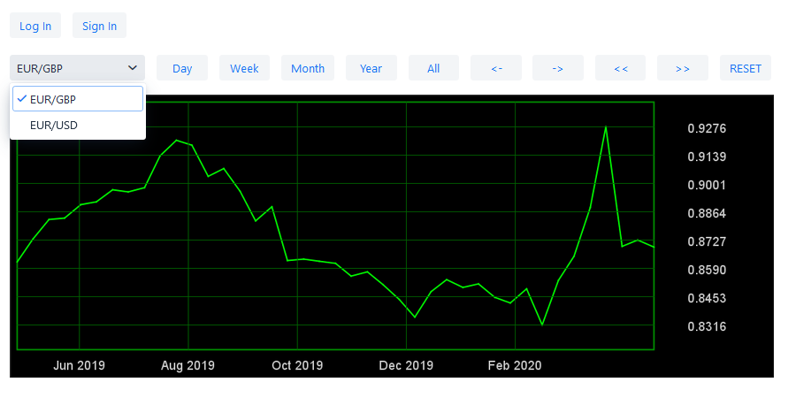

# financial-analytics
Trading and analytics application using Spring Boot and Vaadin.

## Table of contents
* [General info](#general-info)
* [Demo](#demo)
* [Screenshots](#screenshots)
* [Built with](#built-with)
* [Setup](#setup)
* [Features](#features)
* [Status](#status)
* [Inspiration](#inspiration)
* [Contact](#contact)

## General info

The purpose of this application is to enable forex and stock market trading training and to present analyzes and predictions.
I program this application to learn full-stack development. I was a trader before, so the idea came to me naturally.

## Demo
Here is a working live demo : 

## Screenshots

## Built with
* Java 8 
* Spring Boot
* Vaadin
* Gradle

## Setup
1.Clone this repository and build it with gradle

## Features
#### Features working:
* drawing currency pair charts on main page
* parsing csv files compatible with metatrader4

#### Planned features:
* trading on forex and stock market
* simple analysis with basic indicators
* analysis with neural network trained in keras
* chat between users
* order tracking between user

## Status
#### Working:
* main page drawing charts
#### To do soon:
* optimize chart drawing
* implement caching of data for faster retrieving
* enable real time data update
* add login and sign with sending email 
* build user dashboard enabling trading
* build email notifier when order hit stoploss or takeprofit

## Contact
